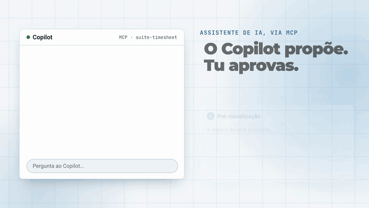
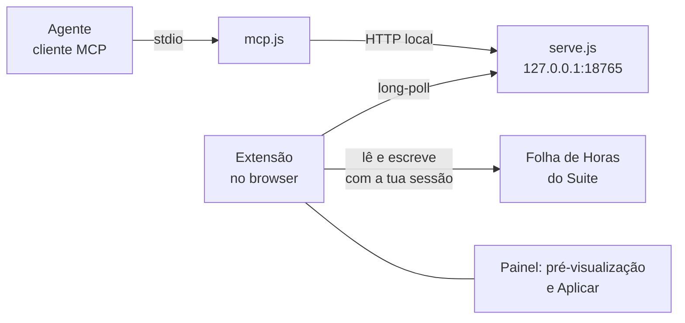
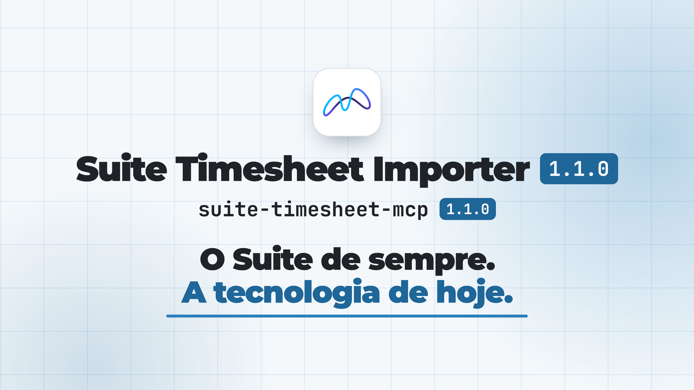

<p align="center">
  
</p>

<h1 align="center">suite-timesheet-mcp</h1>

<p align="center">
  <strong>O agente propõe. Tu aprovas.</strong><br>
  Servidor MCP que deixa um agente de IA <strong>ler e propor horas</strong> na Folha de Horas do
  Suite, através da extensão <strong>Suite Timesheet Importer</strong>.
</p>

<p align="center">
  <a href="https://www.npmjs.com/package/suite-timesheet-mcp"></a>
  
  
  
  
</p>

<p align="center">
  <a href="https://williansaez.github.io/suite-timesheet-mcp/"><strong>Site do projeto</strong></a>
</p>

<p align="center">
  <a href="docs/media/lancamento-1.1.0.mp4">
    
  </a>
  <br>
  <sub>Excerto do vídeo de lançamento da 1.1.0, com o Copilot como exemplo de agente. Clica para ver o vídeo completo. Dados fictícios.</sub>
</p>

## Porquê

O Suite não tem API para agentes. Este pacote dá-lhe uma, sem tocar no Suite:

- **Pedes em linguagem natural.** "Lança 4 h de hoje no Alfa: migração de dados."
- **O agente lê e propõe.** Vê o mês aberto, os projetos do teu dropdown e o que já está
  lançado, e monta a proposta.
- **Tu decides.** A proposta abre no painel da extensão com a pré-visualização. Só é escrita
  depois de aprovares.

Funciona com qualquer agente que fale MCP. O servidor não sabe nem precisa de saber qual é.

## Garantias

- **Nunca fala com o Suite.** Quem lê e escreve é a extensão, no teu browser, com a tua sessão.
- **Nunca escreve sem ti.** Cada lançamento é uma proposta; só é escrito quando clicas Aplicar
  no painel ou aprovas a tool `aplicar` no teu cliente MCP.
- **Nunca submete meses** nem muda o mês aberto na página.
- **Só local.** Escuta apenas em `127.0.0.1`, guarda tudo em memória, não tem telemetria.

Detalhes e forma de verificar cada afirmação: [SECURITY.md](SECURITY.md).

## Requisitos

- Node.js ≥ 20 (`node -v`).
- Microsoft Edge com a extensão [Suite Timesheet Importer](https://microsoftedge.microsoft.com/addons/detail/suite-timesheet-importer/ccmnogdllbomjogpddfedgolgeobhdef) instalada.
- A Folha de Horas do Suite aberta, com sessão válida.

## Instalação

### 1. Ligar a ponte na extensão

Abre `edge://extensions`, clica em **Detalhes** na Suite Timesheet Importer e depois em **Opções da
extensão**. Aí, liga **Ligação ao servidor local (ponte MCP)**, clica em
**Guardar** e aceita a permissão para `http://127.0.0.1/*`. Depois recarrega a Folha de Horas.

Este passo é manual e feito uma vez: sem ele a extensão nunca toca na rede local.

### 2. Registar o servidor no teu agente

Não é preciso clonar nada: o `npx` descarrega o pacote do npm e corre-o. `@1` fixa a versão
principal: recebes as correções 1.x, nunca uma versão incompatível. A primeira execução demora
alguns segundos; as seguintes usam a cache.

**GitHub Copilot (VS Code)**

```bash
code --add-mcp '{"name":"suite-timesheet","command":"npx","args":["-y","suite-timesheet-mcp@1"]}'
```

Depois recarrega a janela; as tools aparecem no modo **Agent** do Copilot.

**Claude Code**

```bash
claude mcp add --scope user suite-timesheet -- npx -y suite-timesheet-mcp@1
```

**Claude Desktop (inclui Cowork)**

Em Definições → Programador → Editar configuração
(`~/Library/Application Support/Claude/claude_desktop_config.json` no macOS,
`%APPDATA%\Claude\claude_desktop_config.json` no Windows):

```json
{
  "mcpServers": {
    "suite-timesheet": {
      "command": "npx",
      "args": ["-y", "suite-timesheet-mcp@1"]
    }
  }
}
```

Reinicia o Claude Desktop.

**Outros agentes**

O mesmo comando: `npx -y suite-timesheet-mcp@1`, por stdio. Atenção à
chave do ficheiro de configuração: o VS Code usa `servers`, a maioria dos outros usa
`mcpServers`.

> Se o cliente não encontrar o `npx` (comum em apps abertas pelo Dock, que não herdam o PATH
> do terminal), usa o caminho absoluto dado por `which npx`. No Windows, usa
> `"command": "cmd"` com `"args": ["/c", "npx", "-y", "…"]`.

### 3. Verificar

Pede ao agente: *"consulta o estado da ponte do Suite Timesheet"*. A tool `estado` deve
responder com a ponte ligada e o mês visível na página. As Opções da extensão passam a mostrar
"Agente ligado há N s" (o texto é o mesmo para qualquer agente).

## Instalação feita por um agente

Se estás a pedir a um agente para instalar isto, ele deve seguir esta ordem e parar no primeiro
passo que falhe:

1. Confirmar `node -v` ≥ 20.
2. Correr o comando do passo 2 correspondente ao cliente em uso.
3. Pedir ao utilizador para fazer o passo 1 (Opções da extensão). O agente não o consegue fazer.
4. Pedir ao utilizador para recarregar o cliente MCP, se o cliente o exigir.
5. Chamar a tool `estado`. Sucesso = ponte ligada e mês visível. Qualquer `ERR_*`: ver
   [Erros](#erros).

O agente **não** deve pôr a tool `aplicar` em aprovação automática.

## Usar

Exemplos de pedidos:

- *"Quantas horas tenho lançadas este mês no Suite?"* → `ler_mes`
- *"Que projetos tenho disponíveis?"* → `projetos`
- *"Lança 8 h no projeto X de segunda a sexta desta semana."* → `propor`, depois `aplicar`
- *"Soma 2 h ao dia de hoje no projeto X, com a nota 'reunião de arranque'."* → `propor` em
  modo `somar`, com `comment`

Lançar horas tem sempre duas fases:

1. **`propor`** calcula o plano, abre o painel da extensão com a pré-visualização e devolve-a ao
   agente. Nada é escrito.
2. **Confirmação**, de uma de duas formas:
   - clicas **Aplicar** no painel, ou
   - dizes OK no chat e aprovas a chamada da tool **`aplicar`** no cliente MCP.

> [!IMPORTANT]
> Mantém a aprovação manual da tool `aplicar`. Com ela em aprovação automática, qualquer
> proposta é escrita sem mais nenhuma confirmação.

Linhas trancadas e propostas bloqueadas são sempre recusadas pela extensão.

## Tools

| tool | faz |
|---|---|
| `estado` | ponte ligada?, mês visível, nº de projetos, lote a correr |
| `projetos` | projetos do dropdown da página: `option_id`, nome, trancado |
| `ler_mes` | horas e Observações já lançadas no mês visível |
| `propor` | calcula o plano, abre o painel, devolve a pré-visualização e um `id` |
| `aplicar` | escreve a proposta `id` no Suite através da extensão, sem esperar pelo clique no painel |
| `resultado` | espera pela decisão (painel ou `aplicar`): aplicado, cancelado, erro ou pendente |

### `propor`

```json
{
  "modo": "somar",
  "linhas": [
    {
      "project": "Alfa - Projeto SAP",
      "date": "2026-10-14",
      "hours": 4,
      "comment": "Migração de dados"
    }
  ]
}
```

| campo | notas |
|---|---|
| `linhas[].option_id` ou `project` | um dos dois: id do dropdown ou nome tal como lá aparece |
| `linhas[].date` | `YYYY-MM-DD`, dentro do mês visível |
| `linhas[].hours` | 0,5 a 23,5 em passos de 0,5; em `somar` pode ser negativo |
| `linhas[].comment` | opcional; vai para as Observações do projeto no mês |
| `modo` | `normal` (defeito), `somar` ou `sobregravar` |
| `nome` | opcional; rótulo que aparece no painel |

| modo | o que vem nas linhas | o que não vem |
|---|---|---|
| `normal` | fica com o valor pedido | fica como está |
| `somar` | Suite + pedido (negativos subtraem) | fica como está |
| `sobregravar` | fica com o valor pedido | é apagado |

Propor duas vezes em `somar` duplica. Mais de 8 h num dia é só aviso.

## Novidades da 1.1.0

- **`propor` aceita `modo`**: `normal`, `somar` ou `sobregravar`, no lugar do antigo `espelho`
  (que continua aceite).
- **`propor` aceita `comment` por linha**, que vai para as Observações do projeto.
- **`ler_mes` devolve as Observações.**
- **Comentários que o Suite ignoraria em silêncio são recusados** antes de propor.
- **`ERR_EXTENSAO_ANTIGA`**: com uma extensão anterior à 1.1.0, os modos `normal` e `somar` são
  recusados, porque a extensão antiga faria outra coisa.

Os modos `normal` e `somar` e os comentários precisam da extensão ≥ 1.1.0.

## Erros

| erro | o que fazer |
|---|---|
| `ERR_SERVE_EM_BAIXO` | o serviço local não responde; reinicia o cliente MCP (ele arranca-o sozinho) |
| `ERR_SEM_CHROME` | abre a Folha de Horas e confirma que a ponte está ligada nas Opções |
| `ERR_SEM_CONTEXTO` | recarrega a Folha de Horas (o serviço reiniciou depois de a página carregar) |
| `ERR_SEM_ABA` | não há nenhum separador do Suite aberto; abre-o ou recarrega-o |
| `ERR_MES_DIFERENTE` | muda o mês na página; o MCP nunca o muda por ti |
| `ERR_OCUPADO` | há uma proposta à espera no painel; aplica-a ou cancela-a primeiro |
| `ERR_LOTE_A_CORRER` | já está um lote a escrever no Suite; espera que termine |
| `ERR_SESSION` | a sessão do Suite expirou; entra outra vez |
| `ERR_PROPOSTA_DESCONHECIDA` | o `id` passado a `aplicar` não corresponde a nenhuma proposta pendente |
| `ERR_EXTENSAO_ANTIGA` | atualiza a extensão para a 1.1.0, ou usa `modo: "sobregravar"` |

Lista completa em [CONTRACT.md](CONTRACT.md).

## Como funciona



1. O cliente MCP arranca o `mcp.js`. Se o serviço local (`serve.js`) não estiver a correr, o
   `mcp.js` arranca-o em segundo plano, em `127.0.0.1:18765`.
2. A extensão, com a Folha de Horas aberta, faz long-poll ao serviço e publica o mês visível.
3. Cada tool enfileira um comando; a extensão executa-o no browser e devolve o resultado.

O protocolo entre o serviço e a extensão está em [CONTRACT.md](CONTRACT.md).

## Configuração avançada

Variáveis de ambiente, no bloco `env` da configuração do cliente MCP:

| variável | efeito |
|---|---|
| `SUITE_TIMESHEET_BASE` | outro endereço local, ex. `http://127.0.0.1:18770`; põe o mesmo nas Opções da extensão |
| `SUITE_TIMESHEET_SEM_AUTOARRANQUE=1` | o `mcp.js` não arranca o serviço; corres tu `node serve.js [porta]` |

Com o serviço gerido à mão, arranca-o **antes** de abrir a Folha de Horas, ou recarrega a página
depois: a extensão só publica o contexto quando a página carrega ou muda de mês.

As tools aceitam `timeout_s` até 290 s (útil em `resultado` com lotes grandes). Se o cliente
cortar a chamada antes disso, aumenta o timeout do cliente MCP (muitos cortam aos 60 s por
defeito).

## Atualizar

As correções 1.x chegam ao reiniciar o cliente MCP (o `npx` volta a consultar o npm). Para uma
versão principal nova, muda `@1` no comando. O serviço local fica a correr entre sessões; para
ele pegar na versão nova, termina-o uma vez
(`lsof -ti tcp:18765 | xargs kill`) e o `mcp.js` arranca o novo.

## Limitações

- Sem autenticação local: qualquer processo do teu utilizador consegue falar com o serviço.
  Páginas web não conseguem. Ver [SECURITY.md](SECURITY.md).
- Tudo em memória: reiniciar o serviço esquece propostas e contexto (recarrega a Folha de Horas).
- Um mês de cada vez: o que está aberto na página.

## Correr a partir de um clone

```bash
git clone https://github.com/williansaez/suite-timesheet-mcp.git
cd suite-timesheet-mcp
npm ci
node --test
```

Para usar a cópia local num cliente, troca o comando `npx …` por
`node /caminho/para/suite-timesheet-mcp/mcp.js`. Também dá para instalar diretamente de uma tag do
GitHub, sem npm: `npx -y github:williansaez/suite-timesheet-mcp#v1.1.0` (precisa de `git`).

## Licença

Código disponível para consulta, **não open source**. Podes instalar e usar o pacote sem
alterações, para uso pessoal ou interno da tua organização. Não é permitido alterá-lo,
redistribuí-lo nem publicar cópias ou forks. Os termos completos (em inglês, com tradução para
português) estão em [LICENSE](LICENSE).

<p align="center">
  
</p>
